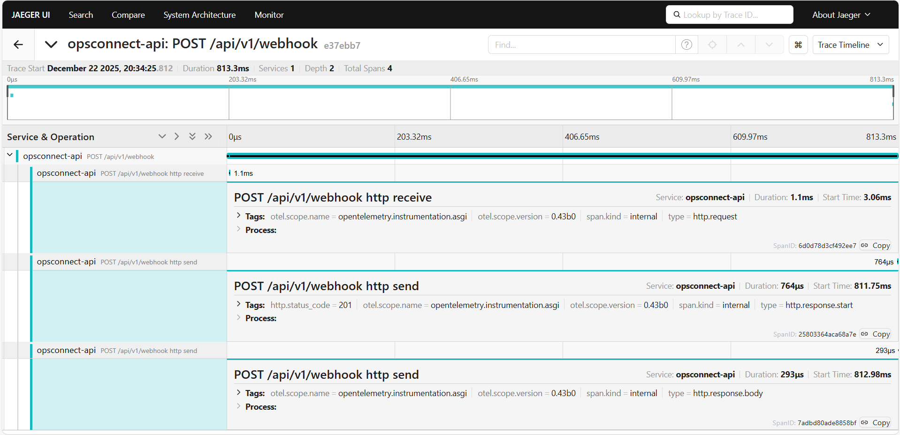

# OpsConnect: Enterprise Data Integration Middleware


**OpsConnect** is a production-grade, asynchronous middleware designed to ingest, validate, and process high-volume webhook streams from enterprise providers (e.g., Salesforce, Stripe) with zero data loss.

Unlike traditional CRUD applications, OpsConnect implements **Hexagonal Architecture (Ports and Adapters)** to decouple core business logic from infrastructure, ensuring long-term maintainability and testability. It features built-in idempotency, distributed tracing, and structural logging, making it ready for high-scale cloud deployments.

---

## 🏗️ Architecture: The "Ports & Adapters" Pattern

The system is built to survive technology shifts. The core business logic resides in the center, isolated from the "outside world" (Database, API, Cache).

```mermaid
graph TD
    Client[External Webhook Source] -->|HTTP POST| API[API Adapter (FastAPI)]
    API -->|Validates| UseCase[Core: Ingest Service]
    
    subgraph "Hexagon (Core Domain)"
        UseCase -->|Interface| DBPort[< Port > Database]
        UseCase -->|Interface| CachePort[< Port > Cache]
    end
    
    DBPort -->|Implements| DBAdapter[Postgres Adapter]
    CachePort -->|Implements| RedisAdapter[Redis Adapter]
    
    DBAdapter -->|Persists| Postgres[(PostgreSQL)]
    RedisAdapter -->|Checks| Redis[(Redis)]
```

## Key Architectural Decisions
* Decoupled Logic: The Core does not know FastAPI or SQLAlchemy exist. This allows for sub-millisecond unit tests and easy framework migration.
* Idempotency (The "Bouncer"): Uses Redis to lock lead_id keys. If a webhook provider retries a request (network blip), the duplicate is safely ignored, preserving data integrity.
* Async I/O: Fully asynchronous database drivers (asyncpg) ensure the API doesn't block under load, allowing handling of thousands of concurrent requests

## 🛠️ Tech Stack

| Component | Technology | Reasoning |
| :--- | :--- | :--- |
| **Runtime** | Python 3.11 | Modern typing features & async support |
| **Framework** | FastAPI | High performance, auto-validation with Pydantic |
| **Database** | PostgreSQL + AsyncPG | Robust relational storage with non-blocking I/O |
| **Cache** | Redis | Fast lookups for idempotency keys |
| **Tracing** | OpenTelemetry + Jaeger | Distributed tracing for performance monitoring |
| **Dependency Mgmt** | Poetry | Deterministic builds and dependency resolution |

## 📊 Observability & Performance

OpsConnect doesn't just run; it explains how it runs. Every request is traced using OpenTelemetry.

### Distributed Tracing (Jaeger)
Below is a trace of a successful webhook ingestion. Notice the granular breakdown of time spent in the API vs. the Database.



## 🛠️ Getting Started
## Prerequisites
* Docker & Docker Compose
### 1. Spin Up the Infrastructure
The entire environment (API, DB, Redis, Jaeger) allows for "Infrastructure as Code" setup.
```bash
docker-compose up --build -d
```

### 2. Apply Database Migrations
We use Alembic to manage schema changes reliably.
```bash
docker-compose exec api alembic upgrade head
```

### 3. Test the Endpoints
*Health Check (Liveness Probe)* Required for Kubernetes deployments to monitor pod health.
```bash
curl http://localhost:8000/api/v1/health
# Response: {"status": "healthy", "db_latency_ms": 12.5}
```

### Ingest Simulation (Salesforce Webhook)
```bash
curl -X POST http://localhost:8000/api/v1/webhook \
  -H "Content-Type: application/json" \
  -d '{"lead_id": "SF-101", "email": "engineer@example.com", "first_name": "Jane", "last_name": "Doe", "source": "web"}'
```

## 📂 Project Structure
A clean, navigable structure that separates concerns.
```PlainText
opsconnect/
├── app/
│   ├── adapters/          # Driven Adapters (DB, Redis, API)
│   ├── core/              # The Hexagon (Business Logic & Ports)
│   ├── infra/             # Dependency Injection & Telemetry config
│   ├── main.py            # Entrypoint
│   └── settings.py        # 12-Factor App Configuration
├── migrations/            # Alembic SQL scripts
├── tests/                 # Pytest suite
├── docker-compose.yaml    # Infrastructure orchestration
├── Dockerfile             # Multi-stage production build
└── pyproject.toml         # Dependency management (Poetry)
```

## 🔮 Future Roadmap
* Add Kafka adapter for event-driven downstream processing.

* Implement Circuit Breaker pattern for database resilience.

* Add Prometheus metrics for request throughput monitoring.

## Author: Shorya Agarwal License: MIT
